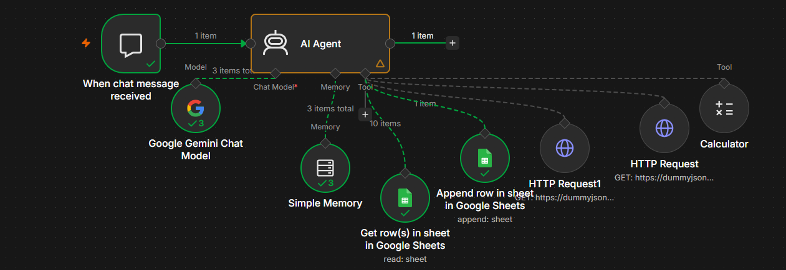

# 🤖 AI Customer Support Agent

An AI-powered customer support automation workflow built with **n8n, Google Gemini, REST APIs, and Google Sheets**.

The agent can understand customer requests, search products, look up orders, perform calculations, create support tickets, detect duplicate tickets, and assign ticket priority.

## 🚀 Features

- 🤖 AI-powered customer conversations using Google Gemini
- 🧠 Conversation memory using n8n Simple Memory
- 🛍️ Product search using REST API
- 📦 Order/cart lookup using REST API
- 🧮 Calculator tool for numerical queries
- 🎫 Automated support ticket creation
- 🔁 Duplicate support ticket detection
- 🚦 Automatic High / Medium / Low priority classification
- 📊 Google Sheets integration for ticket management

## 🏗️ Workflow Architecture

Customer Message
        ↓
Chat Trigger
        ↓
AI Agent
        ↓
Google Gemini
        ↓
┌───────────────────────────────┐
│ Available Tools               │
│                               │
│ • Simple Memory               │
│ • Calculator                  │
│ • Product Search API          │
│ • Order Lookup API            │
│ • Get Existing Tickets        │
│ • Create Support Ticket       │
└───────────────────────────────┘
        ↓
Google Sheets
        ↓
Support Ticket

## 🧰 Technologies Used

- n8n
- Google Gemini API
- Google Sheets
- REST APIs
- DummyJSON API
- AI Agent
- Simple Memory

## 🎫 Ticket Priority

| Priority | Example |
|----------|---------|
| High | Duplicate payment, payment failure, security issue |
| Medium | Delayed delivery, damaged/wrong item |
| Low | General questions and non-urgent assistance |

## 🔁 Duplicate Ticket Protection

Before creating a new support ticket, the agent checks existing tickets in Google Sheets.

If an **Open** ticket already covers the same or very similar unresolved issue, the agent does not create another ticket.

This helps prevent duplicate support requests.

## 📊 Ticket Data

Support tickets are stored in Google Sheets with:

- Ticket ID
- Customer Message
- Order ID
- Priority
- Status
- Session ID
- Created At

## 🧪 Tested Scenarios

The workflow has been tested for:

- Product search
- Order lookup
- Calculator queries
- Conversation memory
- Support ticket creation
- Duplicate ticket detection
- Medium priority delivery issue
- High priority payment issue

## ⚠️ Demo Note

This is a learning/demo project created to demonstrate practical experience with n8n automation, AI agents, APIs, and Google Sheets.

The product and order data used for demonstration comes from mock APIs.

## 🔐 Security

Credentials and API keys are not included in this repository.

Google Gemini and Google Sheets credentials must be configured separately in the user's n8n instance.

## 👨‍💻 Author

**Sachin Kumar**

GitHub: https://github.com/Sachin7017
